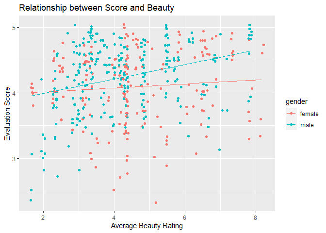

Lab 10 - Grading the professor, Pt. 2
================
Cat Seitz
03.09.2023

### Load packages and data

``` r
library(tidyverse) 
library(tidymodels)
library(openintro)
library(broom)
```

``` r
evals<-evals
```

### Exercise 1

``` r
linear_reg() %>%
  set_engine("lm") %>%
  fit(score ~ bty_avg, data = evals) %>%
  tidy()
```

    ## # A tibble: 2 × 5
    ##   term        estimate std.error statistic   p.value
    ##   <chr>          <dbl>     <dbl>     <dbl>     <dbl>
    ## 1 (Intercept)   3.88      0.0761     51.0  1.56e-191
    ## 2 bty_avg       0.0666    0.0163      4.09 5.08e-  5

``` r
summary(lm(score ~ bty_avg, data = evals))
```

    ## 
    ## Call:
    ## lm(formula = score ~ bty_avg, data = evals)
    ## 
    ## Residuals:
    ##     Min      1Q  Median      3Q     Max 
    ## -1.9246 -0.3690  0.1420  0.3977  0.9309 
    ## 
    ## Coefficients:
    ##             Estimate Std. Error t value Pr(>|t|)    
    ## (Intercept)  3.88034    0.07614   50.96  < 2e-16 ***
    ## bty_avg      0.06664    0.01629    4.09 5.08e-05 ***
    ## ---
    ## Signif. codes:  0 '***' 0.001 '**' 0.01 '*' 0.05 '.' 0.1 ' ' 1
    ## 
    ## Residual standard error: 0.5348 on 461 degrees of freedom
    ## Multiple R-squared:  0.03502,    Adjusted R-squared:  0.03293 
    ## F-statistic: 16.73 on 1 and 461 DF,  p-value: 5.083e-05

Model: (Evaluation Score) = 3.88 + 0.067(Beauty Rating)

The R2 was .035 and the adjusted R2 was .033

### Exercise 2

``` r
linear_reg() %>%
  set_engine("lm") %>%
  fit(score ~ bty_avg + gender, data = evals) %>%
  tidy()
```

    ## # A tibble: 3 × 5
    ##   term        estimate std.error statistic   p.value
    ##   <chr>          <dbl>     <dbl>     <dbl>     <dbl>
    ## 1 (Intercept)   3.75      0.0847     44.3  6.23e-168
    ## 2 bty_avg       0.0742    0.0163      4.56 6.48e-  6
    ## 3 gendermale    0.172     0.0502      3.43 6.52e-  4

``` r
summary(lm(score ~ bty_avg + gender, data = evals))
```

    ## 
    ## Call:
    ## lm(formula = score ~ bty_avg + gender, data = evals)
    ## 
    ## Residuals:
    ##     Min      1Q  Median      3Q     Max 
    ## -1.8305 -0.3625  0.1055  0.4213  0.9314 
    ## 
    ## Coefficients:
    ##             Estimate Std. Error t value Pr(>|t|)    
    ## (Intercept)  3.74734    0.08466  44.266  < 2e-16 ***
    ## bty_avg      0.07416    0.01625   4.563 6.48e-06 ***
    ## gendermale   0.17239    0.05022   3.433 0.000652 ***
    ## ---
    ## Signif. codes:  0 '***' 0.001 '**' 0.01 '*' 0.05 '.' 0.1 ' ' 1
    ## 
    ## Residual standard error: 0.5287 on 460 degrees of freedom
    ## Multiple R-squared:  0.05912,    Adjusted R-squared:  0.05503 
    ## F-statistic: 14.45 on 2 and 460 DF,  p-value: 8.177e-07

Model: Evaluation Score = 3.75 + 0.074(Beauty Rating) + 0.17(Gender)

### Exercise 3

The evaluation score of a female with a beauty rating of 0 is 3.75. With
each point increase in beauty rating, the model predicts a professor can
add .074 points to their evaluation score. The model also predicts that
males have evaluation scores .17 points higher than females.

### Exercise 4

Roughly 5.5% of variability in the professors’ evaluation scores is
explained by the model.

### Exercise 5

Line for just males: Evaluation score = 3.92 + 0.074(Beauty Rating)

### Exercise 6

Males tend to have higher evaluation scores given the same beauty
rating.

### Exercise 7

``` r
model<- lm(score ~ bty_avg * gender, data=evals)

evals<- evals%>% 
  mutate(fitted_values=fitted(model))

ggplot(evals, aes(y = score, x=bty_avg, color=gender))+
  geom_jitter()+
  geom_line(aes(y=fitted_values))+
  #stat_smooth(method="lm", color= "orange", se=FALSE)+
  labs(title="Relationship between Score and Beauty", y="Evaluation Score", x="Average Beauty Rating")
```

<!-- -->

Based on this plot, it looks like the beauty rating matters less for
females than it does for males.

``` r
linear_reg() %>%
  set_engine("lm") %>%
  fit(score ~ bty_avg, data = evals %>% filter(gender=="female")) %>%
  tidy()
```

    ## # A tibble: 2 × 5
    ##   term        estimate std.error statistic  p.value
    ##   <chr>          <dbl>     <dbl>     <dbl>    <dbl>
    ## 1 (Intercept)   3.95      0.126      31.3  1.91e-77
    ## 2 bty_avg       0.0306    0.0257      1.19 2.35e- 1

``` r
linear_reg() %>%
  set_engine("lm") %>%
  fit(score ~ bty_avg, data = evals %>% filter(gender=="male")) %>%
  tidy()
```

    ## # A tibble: 2 × 5
    ##   term        estimate std.error statistic   p.value
    ##   <chr>          <dbl>     <dbl>     <dbl>     <dbl>
    ## 1 (Intercept)    3.77     0.0928     40.6  5.32e-116
    ## 2 bty_avg        0.110    0.0207      5.34 2.04e-  7

Running these models again and filtering the data for each gender, a 1
point increase in beauty rating for females increases the evaluation
score by only 0.03; while for males, it increases the evaluation score
by 0.11.

### Exercise 8

The adjusted R2 increased by 0.022, suggesting gender is useful for
explaining some of the variance in evaluation scores.

### Exercise 9

The slope for m_bty_gen is higher than for m_bty, so adding gender to
the model has changed the parameter estimate for the beuaty rating.

### Exercise 10

``` r
linear_reg() %>%
  set_engine("lm") %>%
  fit(score ~ bty_avg + rank, data = evals) %>%
  tidy()
```

    ## # A tibble: 4 × 5
    ##   term             estimate std.error statistic   p.value
    ##   <chr>               <dbl>     <dbl>     <dbl>     <dbl>
    ## 1 (Intercept)        3.98      0.0908     43.9  2.92e-166
    ## 2 bty_avg            0.0678    0.0165      4.10 4.92e-  5
    ## 3 ranktenure track  -0.161     0.0740     -2.17 3.03e-  2
    ## 4 ranktenured       -0.126     0.0627     -2.01 4.45e-  2

``` r
summary(lm(score ~ bty_avg + rank, data = evals))
```

    ## 
    ## Call:
    ## lm(formula = score ~ bty_avg + rank, data = evals)
    ## 
    ## Residuals:
    ##     Min      1Q  Median      3Q     Max 
    ## -1.8713 -0.3642  0.1489  0.4103  0.9525 
    ## 
    ## Coefficients:
    ##                  Estimate Std. Error t value Pr(>|t|)    
    ## (Intercept)       3.98155    0.09078  43.860  < 2e-16 ***
    ## bty_avg           0.06783    0.01655   4.098 4.92e-05 ***
    ## ranktenure track -0.16070    0.07395  -2.173   0.0303 *  
    ## ranktenured      -0.12623    0.06266  -2.014   0.0445 *  
    ## ---
    ## Signif. codes:  0 '***' 0.001 '**' 0.01 '*' 0.05 '.' 0.1 ' ' 1
    ## 
    ## Residual standard error: 0.5328 on 459 degrees of freedom
    ## Multiple R-squared:  0.04652,    Adjusted R-squared:  0.04029 
    ## F-statistic: 7.465 on 3 and 459 DF,  p-value: 6.88e-05

Model: Evaluation Score = 3.98 + 0.068(Beauty Rating) - 0.16(Tenure
Track) - 0.13(Tenured)

The intercept indicates the evaluation score of a teaching professor
with a beauty rating of 0 (which is very unlikely). With each increase
in point of beauty rating, the predicted evaluation score increases by
.068 points. When predicting the score of a tenure track professor, the
evaluation score decreases by .16 and of a tenured professor, decreases
by .13.

### Exercise 11

I would expect the number of students in the class who completed the
evaluation to be the worst predictor of evaluation score because it
seems completely irrelevant. At first, I was thinking percent of student
who completed the evaluation to also be irrelevant, which still may be
true, but I might expect that a higher percentage of evals completed to
be from professors who are really good or really bad. Lastly, I also
wouldn’t necessarily suspect that the total number of students in the
class, the number of professors to teach the class, or the number of
credits to effect the evaluation score either, but there may be indirect
reasons these would effect the rating.

### Exercise 12

``` r
linear_reg() %>%
  set_engine("lm") %>%
  fit(score ~ cls_did_eval, data = evals) %>%
  tidy()
```

    ## # A tibble: 2 × 5
    ##   term         estimate std.error statistic p.value
    ##   <chr>           <dbl>     <dbl>     <dbl>   <dbl>
    ## 1 (Intercept)  4.15      0.0326      127.     0    
    ## 2 cls_did_eval 0.000759  0.000562      1.35   0.177

``` r
summary(lm(score ~ cls_did_eval, data = evals))
```

    ## 
    ## Call:
    ## lm(formula = score ~ cls_did_eval, data = evals)
    ## 
    ## Residuals:
    ##     Min      1Q  Median      3Q     Max 
    ## -1.8545 -0.3595  0.1303  0.4269  0.8485 
    ## 
    ## Coefficients:
    ##               Estimate Std. Error t value Pr(>|t|)    
    ## (Intercept)  4.1469347  0.0325682 127.331   <2e-16 ***
    ## cls_did_eval 0.0007589  0.0005616   1.351    0.177    
    ## ---
    ## Signif. codes:  0 '***' 0.001 '**' 0.01 '*' 0.05 '.' 0.1 ' ' 1
    ## 
    ## Residual standard error: 0.5434 on 461 degrees of freedom
    ## Multiple R-squared:  0.003946,   Adjusted R-squared:  0.001786 
    ## F-statistic: 1.827 on 1 and 461 DF,  p-value: 0.1772

Model: Evaluation Score = 4.15 + 0.0008(did eval)

Seems like my suspicion was pretty good because the number of students
in the class who completed the evaluation would be a horrible predictor
of the evaluation score.

### Exercise 13

We shouldn’t include cls_did_eval if we are already including
cls_perc_eval and cls_students because then we would be redundant.

### Exercise 14

``` r
linear_reg() %>%
  set_engine("lm") %>%
  fit(score ~ rank + bty_avg + ethnicity + gender + language + age + cls_perc_eval + cls_students + cls_level + cls_profs + cls_credits, data = evals) %>%
  tidy()
```

    ## # A tibble: 13 × 5
    ##    term                   estimate std.error statistic  p.value
    ##    <chr>                     <dbl>     <dbl>     <dbl>    <dbl>
    ##  1 (Intercept)            3.53      0.241       14.7   4.65e-40
    ##  2 ranktenure track      -0.107     0.0820      -1.30  1.93e- 1
    ##  3 ranktenured           -0.0450    0.0652      -0.691 4.90e- 1
    ##  4 bty_avg                0.0613    0.0167       3.67  2.68e- 4
    ##  5 ethnicitynot minority  0.187     0.0775       2.41  1.63e- 2
    ##  6 gendermale             0.179     0.0515       3.47  5.79e- 4
    ##  7 languagenon-english   -0.127     0.108       -1.17  2.41e- 1
    ##  8 age                   -0.00665   0.00308     -2.16  3.15e- 2
    ##  9 cls_perc_eval          0.00570   0.00155      3.67  2.68e- 4
    ## 10 cls_students           0.000445  0.000358     1.24  2.15e- 1
    ## 11 cls_levelupper         0.0187    0.0556       0.337 7.37e- 1
    ## 12 cls_profssingle       -0.00858   0.0514      -0.167 8.67e- 1
    ## 13 cls_creditsone credit  0.509     0.117        4.35  1.70e- 5

``` r
summary(lm(score ~ rank + bty_avg + ethnicity + gender + language + age + cls_perc_eval + cls_students + cls_level + cls_profs + cls_credits, data = evals))
```

    ## 
    ## Call:
    ## lm(formula = score ~ rank + bty_avg + ethnicity + gender + language + 
    ##     age + cls_perc_eval + cls_students + cls_level + cls_profs + 
    ##     cls_credits, data = evals)
    ## 
    ## Residuals:
    ##      Min       1Q   Median       3Q      Max 
    ## -1.84482 -0.31367  0.08559  0.35732  1.10105 
    ## 
    ## Coefficients:
    ##                         Estimate Std. Error t value Pr(>|t|)    
    ## (Intercept)            3.5305036  0.2408200  14.660  < 2e-16 ***
    ## ranktenure track      -0.1070121  0.0820250  -1.305 0.192687    
    ## ranktenured           -0.0450371  0.0652185  -0.691 0.490199    
    ## bty_avg                0.0612651  0.0166755   3.674 0.000268 ***
    ## ethnicitynot minority  0.1869649  0.0775329   2.411 0.016290 *  
    ## gendermale             0.1786166  0.0515346   3.466 0.000579 ***
    ## languagenon-english   -0.1268254  0.1080358  -1.174 0.241048    
    ## age                   -0.0066498  0.0030830  -2.157 0.031542 *  
    ## cls_perc_eval          0.0056996  0.0015514   3.674 0.000268 ***
    ## cls_students           0.0004455  0.0003585   1.243 0.214596    
    ## cls_levelupper         0.0187105  0.0555833   0.337 0.736560    
    ## cls_profssingle       -0.0085751  0.0513527  -0.167 0.867458    
    ## cls_creditsone credit  0.5087427  0.1170130   4.348  1.7e-05 ***
    ## ---
    ## Signif. codes:  0 '***' 0.001 '**' 0.01 '*' 0.05 '.' 0.1 ' ' 1
    ## 
    ## Residual standard error: 0.504 on 450 degrees of freedom
    ## Multiple R-squared:  0.1635, Adjusted R-squared:  0.1412 
    ## F-statistic: 7.331 on 12 and 450 DF,  p-value: 2.406e-12

### Exercise 15

``` r
linear_reg() %>%
  set_engine("lm") %>%
  fit(score ~ bty_avg + ethnicity + gender + cls_credits, data = evals) %>%
  tidy()
```

    ## # A tibble: 5 × 5
    ##   term                  estimate std.error statistic   p.value
    ##   <chr>                    <dbl>     <dbl>     <dbl>     <dbl>
    ## 1 (Intercept)             3.51      0.104      33.8  2.23e-126
    ## 2 bty_avg                 0.0821    0.0158      5.20 3.03e-  7
    ## 3 ethnicitynot minority   0.208     0.0718      2.89 4.01e-  3
    ## 4 gendermale              0.147     0.0490      3.00 2.89e-  3
    ## 5 cls_creditsone credit   0.580     0.105       5.50 6.29e-  8

``` r
summary(lm(score ~ bty_avg + ethnicity + gender + cls_credits, data = evals))
```

    ## 
    ## Call:
    ## lm(formula = score ~ bty_avg + ethnicity + gender + cls_credits, 
    ##     data = evals)
    ## 
    ## Residuals:
    ##      Min       1Q   Median       3Q      Max 
    ## -1.84613 -0.35225  0.08913  0.38913  0.92237 
    ## 
    ## Coefficients:
    ##                       Estimate Std. Error t value Pr(>|t|)    
    ## (Intercept)            3.51398    0.10406  33.767  < 2e-16 ***
    ## bty_avg                0.08214    0.01580   5.199 3.03e-07 ***
    ## ethnicitynot minority  0.20775    0.07183   2.892  0.00401 ** 
    ## gendermale             0.14687    0.04903   2.996  0.00289 ** 
    ## cls_creditsone credit  0.58015    0.10546   5.501 6.29e-08 ***
    ## ---
    ## Signif. codes:  0 '***' 0.001 '**' 0.01 '*' 0.05 '.' 0.1 ' ' 1
    ## 
    ## Residual standard error: 0.5119 on 458 degrees of freedom
    ## Multiple R-squared:  0.1216, Adjusted R-squared:  0.114 
    ## F-statistic: 15.86 on 4 and 458 DF,  p-value: 3.644e-12

Using backward-selection, I’ve come to the following model:

Evaluation score = 3.51 + 0.082(Beauty rating) +
0.21(Ethnicity/Non-minority) + 0.15(Gender/Male) + 0.58(Number of
Credits/1 credit)

### Exercise 16

With a 1 point increase in beauty rating, the model predicts a professor
will gain .082 points in evaluation score. A 1 credit course is
predicted to get .58 points higher in evaluation score than a
mulit-credit course.

### Exercise 17

Based on my final model, the predicted highest evaluation score is
awarded to a non-minority, male professor with a high beauty rating that
is teaching a 1 credit course.

### Exercise 18

I wouldn’t necessarily want to generalize this model to all
universities. This model could be affected by the type of university or
the country it is in. So, before generalizing, we would want to make
sure those factors don’t make a difference in the model. For example,
different countries may have different biases regarding gender, beauty,
ethnicity, etc. Even different areas of the U.S. may show differences in
these biases.
